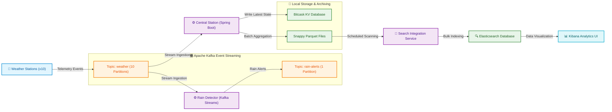

# 🌦️ Weather Stations Monitoring System

An enterprise-grade, distributed, real-time weather telemetry processing pipeline. This system ingests simulated meteorological sensor data from multiple weather stations, filters and detects weather anomalies (such as rain events) in real-time, archives data in compact column-oriented Parquet files, indexes archives into Elasticsearch for full-text search, and visualizes them on Kibana dashboards. It also features a custom-built, fully compliant implementation of the **Bitcask Key-Value Storage Engine** in Java for fast state querying.

---

## 🏗️ System Architecture & Data Pipeline

The pipeline is built on a highly decoupled event-driven architecture utilizing Apache Kafka as the main streaming backbone. Below is the end-to-end data flow:



---

## 🛠️ Technology Stack & Core Components

| Component | Technology | Description |
| :--- | :--- | :--- |
| **Messaging Infrastructure** | Apache Kafka & Zookeeper | Ingestion buffer ensuring strictly ordered delivery per weather station through partition routing. |
| **Telemetry Simulators** | Java & Docker | 10 independent weather station instances generating simulated temperature, humidity, wind speed, and battery status metrics. |
| **Stream Processing** | Kafka Streams API | Real-time window-less processor detecting rain events based on humidity thresholds and dispatching alert notifications. |
| **Central Ingestion Service** | Spring Boot | Coordinates stream consumption, state persistence, DLQ error handling, and Parquet formatting. |
| **Key-Value Store** | **Custom Java Bitcask Engine** | High-performance, append-only storage engine with low latency queries, background compaction, and startup crash-recovery. |
| **Cold Data Archiver** | Avro Schema & Apache Parquet | Writes telemetry in Snappy-compressed column-oriented formats, partitioned hierarchically on disk. |
| **Analytics Engine** | Elasticsearch & Kibana | Full-text query engine indexing cold Parquet files for dashboarding and analysis. |
| **Container Orchestration** | Docker Compose & Kubernetes (Minikube) | Multi-environment deployment manifests for local and cloud-native simulation. |

---

## 🧩 Deep Dive: Custom Java Bitcask Key-Value Engine

Implemented inside the [Central_Station](file:///home/rafy/Materials/4th_year/2nd_semester/Data_Intensive/Assignments/Weather-Stations-Monitoring-System/Central_Station) module, the Bitcask Engine ([BitcaskEngine.java](file:///home/rafy/Materials/4th_year/2nd_semester/Data_Intensive/Assignments/Weather-Stations-Monitoring-System/Central_Station/src/main/java/com/example/Centeral_Station/Bitcask/engine/BitcaskEngine.java)) replicates the original Bitcask design papers for high-performance log-structured key-value storage:

1. **Write Path (Append-Only Log)**
   * Every `put` operation serializes the [WeatherStatus](file:///home/rafy/Materials/4th_year/2nd_semester/Data_Intensive/Assignments/Weather-Stations-Monitoring-System/Central_Station/src/main/java/com/example/Centeral_Station/dto/WeatherStatus.java) into binary format and appends it to the active data log via [WriterBitcask.java](file:///home/rafy/Materials/4th_year/2nd_semester/Data_Intensive/Assignments/Weather-Stations-Monitoring-System/Central_Station/src/main/java/com/example/Centeral_Station/Bitcask/fileHandler/WriterBitcask.java).
   * This guarantees $O(1)$ writes since no disk seeks are required.
2. **In-Memory Index (`keyDir`)**
   * A thread-safe, concurrent hash map stores references to every key's location on disk (`KeyDirRecord`).
   * The reference contains `filename`, `value_offset`, and `value_size`.
3. **Read Path (Single-Seek Gets)**
   * During a `get` operation, the engine locates the `KeyDirRecord` in memory, then directly seeks to the offset on disk inside [ReaderBitcask.java](file:///home/rafy/Materials/4th_year/2nd_semester/Data_Intensive/Assignments/Weather-Stations-Monitoring-System/Central_Station/src/main/java/com/example/Centeral_Station/Bitcask/fileHandler/ReaderBitcask.java).
   * This guarantees a maximum of **one disk seek** per read, making it extremely fast.
4. **Compaction (Garbage Collection)**
   * In-place updates to keys result in "dead" space in append-only files.
   * A scheduled background worker (`compactBitcask()`) triggers every 10 seconds. It writes only the active (latest) records to a new compacted log file and purges obsolete data and log files.
5. **Crash Recovery & Hint Files**
   * During compaction, a `.hint` file is generated detailing keys and their offsets inside the compacted data file.
   * Upon startup, `@PostConstruct` launches the `recoveryBitcask()` handler, scanning only the compact `.hint` files to rebuild the memory index instantly without re-reading large data files.

---

## 📊 Performance Profiling & JFR Logs

The Central Station is configured with **Java Flight Recorder (JFR)** to profile performance bottlenecks during high-throughput stress tests. 

* The [Dockerfile](file:///home/rafy/Materials/4th_year/2nd_semester/Data_Intensive/Assignments/Weather-Stations-Monitoring-System/Central_Station/Dockerfile) executes Central Station with flight recording enabled:
  ```bash
  java -XX:StartFlightRecording=duration=60s,settings=profile,filename=/app/data/central_profile.jfr -jar central-station.jar
  ```
* Historical recordings, graphs, and JFR metrics are archived in the [JFR Directory](file:///home/rafy/Materials/4th_year/2nd_semester/Data_Intensive/Assignments/Weather-Stations-Monitoring-System/JFR):
  - **Memory Allocation Profiling**: Visualized in [memory.png](file:///home/rafy/Materials/4th_year/2nd_semester/Data_Intensive/Assignments/Weather-Stations-Monitoring-System/JFR/memory.png).
  - **Garbage Collection Overhead**: Visualized in [GC.png](file:///home/rafy/Materials/4th_year/2nd_semester/Data_Intensive/Assignments/Weather-Stations-Monitoring-System/JFR/GC.png).
  - **Disk I/O Latency**: Visualized in [file-IO.png](file:///home/rafy/Materials/4th_year/2nd_semester/Data_Intensive/Assignments/Weather-Stations-Monitoring-System/JFR/file-IO.png) (demonstrates sequential append performance).
  - **Socket & Network Latency**: Visualized in [socket-IO.png](file:///home/rafy/Materials/4th_year/2nd_semester/Data_Intensive/Assignments/Weather-Stations-Monitoring-System/JFR/socket-IO.png) (analyzes Kafka ingestion socket connections).
  - **Profile Data**: Raw recording is saved in [central_profile3.jfr](file:///home/rafy/Materials/4th_year/2nd_semester/Data_Intensive/Assignments/Weather-Stations-Monitoring-System/JFR/central_profile3.jfr) for inspection in Java Mission Control (JMC).

---

## 🚀 How to Run and Use

You can run the environment locally using **Docker Compose** or inside a local **Kubernetes Cluster**.

### Option A: Local Run via Docker Compose

1. **Start all infrastructure and services**:
   ```bash
   docker compose up --build -d
   ```

2. **Verify the Logs**:
   ```bash
   # Check that weather stations are generating and sending data
   docker logs -f weather-station-1
   
   # Check that the rain detector is outputting alerts
   docker logs -f rain-detector
   
   # Verify the central station is consuming telemetry and writing to Bitcask
   docker logs -f central-station
   ```

---

### Option B: Cluster Run via Kubernetes (Minikube)

A comprehensive script [start_cluster.sh](file:///home/rafy/Materials/4th_year/2nd_semester/Data_Intensive/Assignments/Weather-Stations-Monitoring-System/start_cluster.sh) compiles, builds, and deploys the entire stack onto a Kubernetes namespace.

1. **Verify your local cluster is clear and start the cluster deployment**:
   ```bash
   chmod +x start_cluster.sh
   ./start_cluster.sh
   ```
2. **What the deployment script does**:
   * Launches Minikube using the Docker driver (configured with 4 CPUs, 6GB RAM).
   * Switches the local shell's Docker environment to build images inside Minikube.
   * Compiles the source files and builds cached Docker images for `weather-station:1.0`, `rain-detector:1.0`, `central-station:1.0`, and `search-integration:1.0`.
   * Applies the Kubernetes configurations located in the [k8s directory](file:///home/rafy/Materials/4th_year/2nd_semester/Data_Intensive/Assignments/Weather-Stations-Monitoring-System/k8s):
     1. Creates the custom namespace: `weather-station` ([namespace.yaml](file:///home/rafy/Materials/4th_year/2nd_semester/Data_Intensive/Assignments/Weather-Stations-Monitoring-System/k8s/namespace.yaml)).
     2. Sets up Persistent Volume Claims (PVC) for shared data storage ([shared_storage.yaml](file:///home/rafy/Materials/4th_year/2nd_semester/Data_Intensive/Assignments/Weather-Stations-Monitoring-System/k8s/shared_storage.yaml)).
     3. Starts Zookeeper & Kafka brokers ([broker/](file:///home/rafy/Materials/4th_year/2nd_semester/Data_Intensive/Assignments/Weather-Stations-Monitoring-System/k8s/broker)).
     4. Starts Elasticsearch, Kibana, and the Search Integration Service ([search/](file:///home/rafy/Materials/4th_year/2nd_semester/Data_Intensive/Assignments/Weather-Stations-Monitoring-System/k8s/search)).
     5. Waits for the brokers and storage pods to report a `Ready` condition.
     6. Starts Central Station, Rain Detector, and Weather Station pods ([weather_services/](file:///home/rafy/Materials/4th_year/2nd_semester/Data_Intensive/Assignments/Weather-Stations-Monitoring-System/k8s/weather_services)).
     7. Establishes port-forward connections to make Kafka (`30092`) and Central Station (`30080`) accessible locally, and tunnels Kibana interface to the browser.

---

## 🔍 Interacting with the Services

### 1. Query the Bitcask REST API
Once running, Central Station exposes the state of the system via `/bitcask` endpoints.

* **Retrieve the latest reading for Weather Station 1**:
  ```bash
  # For Docker Compose (Port 8080)
  curl http://localhost:8080/bitcask/1
  
  # For Kubernetes Port Forward (Port 30080)
  curl http://localhost:30080/bitcask/1
  ```
  *Response Format:*
  ```json
  {
    "station_id": 1,
    "s_no": 124,
    "battery_status": "medium",
    "status_timestamp": 1716718223,
    "weather": {
      "humidity": 45,
      "temperature": 78,
      "wind_speed": 12
    }
  }
  ```

* **Retrieve the latest readings from all active stations**:
  ```bash
  curl http://localhost:8080/bitcask/all
  ```

* **Insert a manual telemetry status**:
  ```bash
  curl -X POST http://localhost:8080/bitcask/put \
       -H "Content-Type: application/json" \
       -d '{"station_id": 99, "s_no": 1, "battery_status": "high", "status_timestamp": 1716718224, "weather": {"humidity": 80, "temperature": 70, "wind_speed": 5}}'
  ```

### 2. View Cold Archives
Cold data is written in snappy-compressed Parquet files and stored under:
```
data/parquet_archives/station_id={station_id}/date={YYYY-MM-DD}/
```
You can view these files directly inside the `central-station` volume or the shared PVC on Kubernetes.

### 3. Check Kibana Dashboard
* Access the UI at: `http://localhost:5601`
* Go to **Management > Stack Management > Index Patterns** (or Data Views) and create a view for `weather_statuses`.
* Head to **Discover** or create a **Dashboard** to construct real-time analytics graphs based on temperature trends, wind speed histograms, and battery charge deterioration curves.